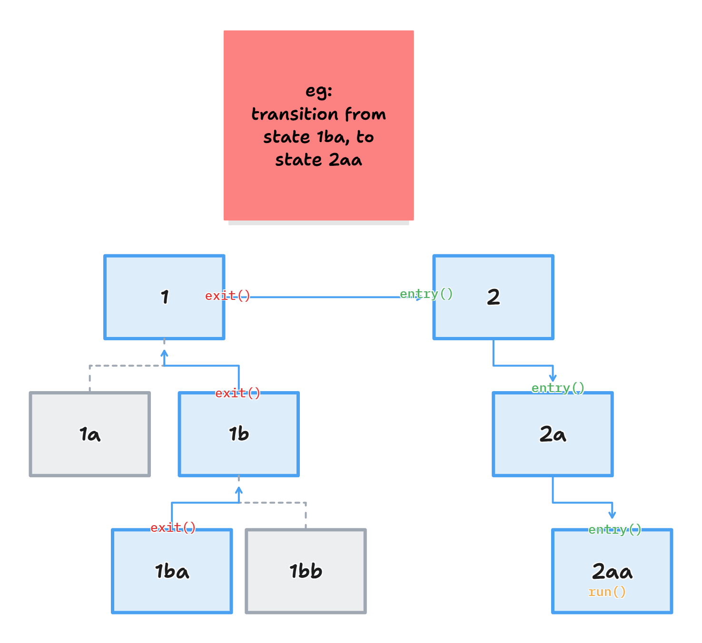
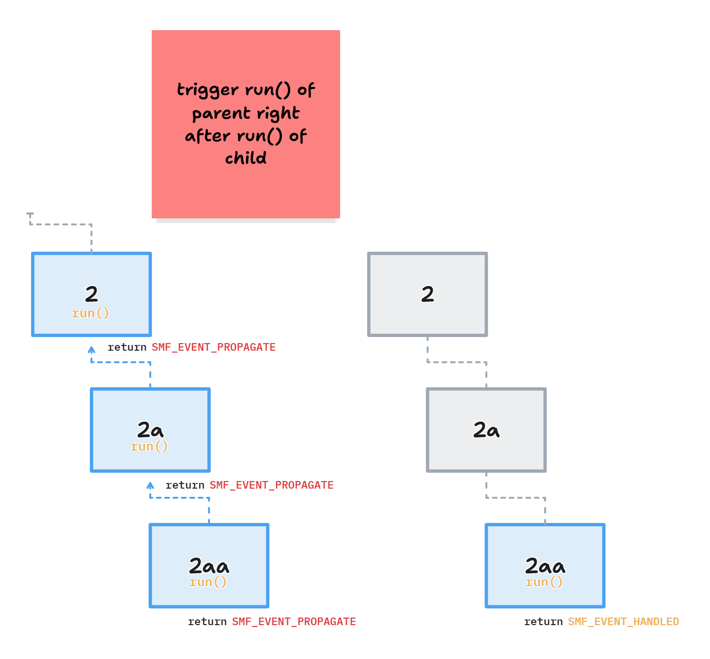

# RFC: Explore Implementation of SMF (State Machine Framework)

## Introduction

## AEM (App Event Manager)

Functions as the "nervous system" within the system. Events are generated for the purpose of communicating between modules. After a module receives an event it cares about, it turns into its internal thread that processes that event, and might (or might not) then manage said module's internal states. This internal state management currently does not follow any particular framework — just written in a certain way out of habit. This may lead to:

- Inconsistency of implementation among modules, causing bad readability and more human error
- Unrobustness because it only enables flat state machines (non-hierarchical)

## SMF (State Machine Framework)

SMF tries to solve this problem by providing a more robust State Machine implementation. It acts mainly as a generic and lightweight state machine runner — the "brain" of a certain module, with formal structure. Key features:

- **Hierarchical State Machines (HSM)** support
- **State entry, run, and exit** callbacks for each state transition
- Acts like a tree node traverser: triggers `exit()` as soon as a child's parent goes out of scope, and triggers `entry()` as a parent node acting as "gateway" needs to be passed through



---

# Recreating `ble.c`

## Current Implementation

> _Note: Do not focus on the specific implementation written here — focus on the refactoring possibilities and design patterns being used as discourse for decision making._

```c
// a static global state
static enum state_type {
    STATE_BLE_INIT,
    STATE_BLE_READY,
    STATE_BLE_CONNECTED,
    STATE_BLE_DISCONNECTED,
    STATE_BLE_SENSOR_DATA_TRANSFER,
    STATE_SHUTDOWN
} state;

static char *state2str(enum state_type state)
{
    switch (state) {
    case STATE_BLE_INIT:                 return "STATE_BLE_INIT";
    case STATE_BLE_READY:                return "STATE_BLE_READY";
    case STATE_BLE_DISCONNECTED:         return "STATE_BLE_DISCONNECTED";
    case STATE_BLE_CONNECTED:            return "STATE_BLE_CONNECTED";
    case STATE_BLE_SENSOR_DATA_TRANSFER: return "STATE_BLE_SENSOR_DATA_TRANSFER";
    case STATE_SHUTDOWN:                 return "STATE_SHUTDOWN";
    default:                             return "Unknown";
    }
}

// setting the static global state
static void state_set(enum state_type new_state)
{
    if (new_state == state) {
        LOG_DBG("State: %s", state2str(state));
        return;
    }

    LOG_DBG("State transition %s --> %s",
        state2str(state),
        state2str(new_state));

    state = new_state;
}

// ...

static void module_thread_fn(void)
{
    int err;
    struct ble_msg_data msg = { 0 };

    ble.self.thread_id = k_current_get();

    err = module_start(&ble.self);
    if (err) {
        LOG_ERR("Failed starting module, error: %d", err);
        SEND_ERROR(ble, BLE_EVT_ERROR, err);
    }

    state_set(STATE_BLE_INIT);

    while (true) {
        module_get_next_msg(&ble.self, &msg);

        switch (state) {
        case STATE_BLE_INIT:
            on_state_init(&msg);
            break;
        case STATE_BLE_READY:
        case STATE_BLE_DISCONNECTED:
        case STATE_BLE_CONNECTED:
        case STATE_BLE_SENSOR_DATA_TRANSFER:
            message_handler(&msg);
            break;
        case STATE_SHUTDOWN:
            break;
        default:
            LOG_ERR("Unknown state.");
            break;
        }
    }
}

static void message_handler(struct ble_msg_data *msg)
{
    if (IS_EVENT(msg, message, MESSAGE_EVT_PAYLOAD_READY)) {
        LOG_DBG("sending payload via BLE ...");
        // ...
        send_ble_notification((const uint8_t *) payload, sizeof(payload));
    } else if (IS_EVENT(msg, message, MESSAGE_EVT_CMD_RECEIVED)) {
        // ...
    }
}
```

## Refactored Using SMF

### Substitution of Classic State Logic with SMF

- Add `smf_ctx` & `smf_event` inside `ble_t`
- Implement `state_type` in HSM form and EVENT BITs for SMF use — intentional indentation emphasizes parent-child state relationships
- Call `smf_set_state` where appropriate (inside a `state_ble_xxxx_yyyy`, or from a callback like `.connected`)
- Utilize local events (`k_event_wait` with `K_NO_WAIT`) to help `state_ble_xxxx_run` decide what to process

```c
/* Replace the enum with SMF state objects */
static const struct smf_state states[];

/* Event definitions */
#define EVENT_ADV_STOP          BIT(0)
#define EVENT_START_STREAMING   BIT(1)
#define EVENT_STOP_STREAMING    BIT(2)
#define EVENT_USB_CONNECTED     BIT(3)
#define EVENT_PAYLOAD_READY     BIT(4)

typedef struct {
    struct smf_ctx ctx;
    struct k_event smf_event;
    struct bt_conn *current_conn;
    bool start_stream;
    struct bt_gatt_service gatt_service;
    char name[CONFIG_BT_DEVICE_NAME_MAX];
    struct k_timer connection_timeout;
    struct k_sem param_update_sem;
    struct k_sem connect_sem;
    struct k_sem data_thread_sem;
} ble_t;

static ble_t ble;

// State enumeration (indentation emphasizes parent-child relationship)
static enum state_type {
    STATE_BLE_INIT,
    STATE_BLE_READY,
        STATE_BLE_CONNECTED,
            STATE_BLE_SENSOR_DATA_TRANSFER,
        STATE_BLE_DISCONNECTED,
    STATE_SHUTDOWN
} current_state;

/* State functions */
static void state_ble_init_run(void *o) {
    bt_enable(NULL);
    smf_set_state(SMF_CTX(&ble), &states[STATE_BLE_READY]);
}

static void state_ble_ready_run(void *o) {
    // Always transition to DISCONNECTED when READY state runs
    smf_set_state(SMF_CTX(&ble), &states[STATE_BLE_DISCONNECTED]);
}

static void state_ble_disconnected_entry(void *o) {
    LOG_INF("Entering BLE_DISCONNECTED");
    advertising_start(); // ensure called at least once, after initialization
}

static void state_ble_disconnected_run(void *o) {
    ble_t *s = (ble_t *)o;

    if (s->current_conn != NULL) {
        smf_set_state(SMF_CTX(s), &states[STATE_BLE_CONNECTED]);
        return;
    }

    if (k_event_wait(&s->smf_event, EVENT_USB_CONNECTED, false, K_NO_WAIT)) {
        smf_set_state(SMF_CTX(s), &states[STATE_SHUTDOWN]);
        k_event_clear(&s->smf_event, EVENT_USB_CONNECTED);
    }
}

static void state_ble_disconnected_exit(void *o) {
    LOG_INF("Exiting BLE_DISCONNECTED");
    advertising_stop(); // called once when successfully BLE connected
}

static void state_ble_connected_run(void *o) {
    ble_t *s = (ble_t *)o;

    if (s->current_conn == NULL) {
        smf_set_state(SMF_CTX(s), &states[STATE_BLE_DISCONNECTED]);
        return;
    }

    if (k_event_wait(&s->smf_event, EVENT_START_STREAMING, false, K_NO_WAIT)) {
        smf_set_state(SMF_CTX(s), &states[STATE_BLE_SENSOR_DATA_TRANSFER]);
        k_event_clear(&s->smf_event, EVENT_START_STREAMING);
        return;
    }

    if (k_event_wait(&s->smf_event, EVENT_USB_CONNECTED, false, K_NO_WAIT)) {
        if (s->current_conn) {
            bt_conn_disconnect(s->current_conn, BT_HCI_ERR_REMOTE_USER_TERM_CONN);
        }
        smf_set_state(SMF_CTX(s), &states[STATE_SHUTDOWN]);
        k_event_clear(&s->smf_event, EVENT_USB_CONNECTED);
    }
}

static void state_ble_data_transfer_entry(void *o) {
    LOG_INF("Entering BLE_SENSOR_DATA_TRANSFER");
    ble_t *s = (ble_t *)o;
    s->start_stream = true;
}

static void state_ble_data_transfer_run(void *o) {
    ble_t *s = (ble_t *)o;

    if (k_event_wait(&s->smf_event, EVENT_STOP_STREAMING, false, K_NO_WAIT)) {
        smf_set_state(SMF_CTX(s), &states[STATE_BLE_CONNECTED]);
        k_event_clear(&s->smf_event, EVENT_STOP_STREAMING);
        return;
    }

    if (s->current_conn == NULL) {
        smf_set_state(SMF_CTX(s), &states[STATE_BLE_DISCONNECTED]);
        return;
    }

    if (k_event_wait(&s->smf_event, EVENT_USB_CONNECTED, false, K_NO_WAIT)) {
        if (s->current_conn) {
            bt_conn_disconnect(s->current_conn, BT_HCI_ERR_REMOTE_USER_TERM_CONN);
        }
        smf_set_state(SMF_CTX(s), &states[STATE_SHUTDOWN]);
        k_event_clear(&s->smf_event, EVENT_USB_CONNECTED);
        return;
    }

    if (s->start_stream && data_available()) {
        sensor_data_t data = acquire_sensor_data();
        process_and_filter_data(&data);
        send_ble_notification((uint8_t*)&data, sizeof(data));
    }
}

static void state_ble_data_transfer_exit(void *o) {
    LOG_INF("Exiting BLE_SENSOR_DATA_TRANSFER");
    ble_t *s = (ble_t *)o;
    s->start_stream = false;
}

static const struct smf_state states[] = {
    [STATE_BLE_INIT]               = SMF_CREATE_STATE(NULL, state_ble_init_run, NULL, NULL, NULL),
    [STATE_BLE_READY]              = SMF_CREATE_STATE(NULL, state_ble_ready_run, NULL, NULL, NULL),
    [STATE_BLE_CONNECTED]          = SMF_CREATE_STATE(NULL, state_ble_connected_run, NULL, &states[STATE_BLE_READY], NULL),
    [STATE_BLE_DISCONNECTED]       = SMF_CREATE_STATE(state_ble_disconnected_entry, state_ble_disconnected_run, state_ble_disconnected_exit, &states[STATE_BLE_READY], NULL),
    [STATE_BLE_SENSOR_DATA_TRANSFER] = SMF_CREATE_STATE(state_ble_data_transfer_entry, state_ble_data_transfer_run, state_ble_data_transfer_exit, &states[STATE_BLE_CONNECTED], NULL),
    [STATE_SHUTDOWN]               = SMF_CREATE_STATE(state_shutdown_entry, NULL, NULL, NULL, NULL)
};
```

### Add-on to BLE Logic

Calling state change and `event_post` from connection callbacks:

```c
static void connected(struct bt_conn *conn, uint8_t err)
{
    smf_set_state(SMF_CTX(&ble), &states[STATE_BLE_CONNECTED]);
    k_event_post(&ble.smf_event, EVENT_ADV_STOP);
}

static void disconnected(struct bt_conn *conn, uint8_t err)
{
    smf_set_state(SMF_CTX(&ble), &states[STATE_BLE_DISCONNECTED]);
}

BT_CONN_CB_DEFINE(conn_callbacks) = {
    .connected    = connected,
    .disconnected = disconnected,
};
```

### Add-on to AEM Logic

Key changes:

- State logic offloaded from `message_handler` — now just calls `k_event_post`, later processed within each `state_ble_xxxx_run`. **Rather than having all state logic inside a single per-module `message_handler`, each `state_run` becomes its own state-level message handler.** This requires using `k_event` (with pros and cons).
- `STATE_BLE_INIT` is no longer needed in the switch — logic is moved into `state_ble_init_run`
- `smf_run_state` is moved below `message_handler` so any state change requests can be processed properly

```
ble_event_handler --> message_handler --> state_ble_xxx_run
```

```c
static void module_thread_fn(void)
{
    int err;
    struct ble_msg_data msg = { 0 };

    ble.self.thread_id = k_current_get();

    err = module_start(&ble.self);
    if (err) {
        LOG_ERR("Failed starting module, error: %d", err);
        SEND_ERROR(ble, BLE_EVT_ERROR, err);
    }

    smf_set_initial(SMF_CTX(&ble), &states[STATE_BLE_INIT]);

    while (true) {
        module_get_next_msg(&ble.self, &msg);

        /* Process message in current state context */
        message_handler(&msg);

        /* SMF handles state change requests and runs state_run logic */
        smf_run_state(SMF_CTX(&ble));

        k_sleep(K_MSEC(10));
    }
}

static void message_handler(struct ble_msg_data *msg)
{
    if (IS_EVENT(msg, app, APP_EVT_BLE_START_STREAMING)) {
        LOG_DBG("Start streaming event");
        k_event_post(&ble.smf_event, EVENT_START_STREAMING);

    } else if (IS_EVENT(msg, app, APP_EVT_BLE_STOP_STREAMING)) {
        LOG_DBG("Stop streaming event");
        k_event_post(&ble.smf_event, EVENT_STOP_STREAMING);

    } else if (IS_EVENT(msg, app, APP_EVT_USB_CONNECTED)) {
        LOG_DBG("USB connected event");
        k_event_post(&ble.smf_event, EVENT_USB_CONNECTED);
    }
    // ... other events
}

static bool ble_event_handler(const struct app_event_header *aeh)
{
    struct ble_msg_data msg = {0};
    bool enqueue_msg = false;

    if (is_app_module_event(aeh)) {
        struct app_module_event *evt = cast_app_module_event(aeh);
        msg.module.app = *evt;
        enqueue_msg = true;
    }

    // ...

    if (enqueue_msg) {
        int err = module_enqueue_msg(&ble.self, &msg);

        if (err) {
            LOG_ERR("Message could not be enqueued");
            SEND_ERROR(ble, BLE_EVT_ERROR, err);
        }
    }
    return false;
}

K_THREAD_DEFINE(ble_module_thread, CONFIG_BLE_THREAD_STACK_SIZE,
        module_thread_fn, NULL, NULL, NULL,
        BLE_HIGH_PRIO, 0, 0);
APP_EVENT_LISTENER(MODULE, ble_event_handler);
```

---

# Composite vs Flat States

Composite states automatically trigger **child run propagation** — an **upwards automatic propagation behavior**. If a parent is set as state and it has been created as "composite" with a chosen initial child state, it acts as if both were called sequentially:

- **Entry:** `composite_parent_entry` → `composite_child_entry`
- **Run:** `composite_child_run` → `composite_parent_run`
- **Exit:** `composite_child_exit` → `composite_parent_exit`

If a `composite_parent` is set as state, the `composite_child` is implicitly set as a "hidden" state — called first for run, then propagates upwards sequentially.

## Example Snippet Demonstrating Both Behaviors

```c
#include <zephyr/kernel.h>
#include <zephyr/smf.h>
#include <zephyr/logging/log.h>

#define MODULE MAIN_MODULE
LOG_MODULE_REGISTER(MODULE, 3);

static const struct smf_state states[];

enum state_id { COMP_PARENT, COMP_CHILD_A, COMP_CHILD_B, FLAT_PARENT, FLAT_CHILD };

struct s_object {
    struct smf_ctx ctx;
} obj;

// ------------ COMP_PARENT ------------
static void comp_parent_entry(void *o) { LOG_INF("COMP_PARENT_ENTRY"); }
static void comp_parent_run(void *o) {
    static int count = 0;
    LOG_INF("COMP_PARENT_RUN - count: %d", ++count);
    if (count == 3) {
        count = 0;
        LOG_INF("*** Transitioning to FLAT_PARENT state ***");
        smf_set_state(SMF_CTX(o), &states[FLAT_PARENT]);
    }
}
static void comp_parent_exit(void *o) { LOG_INF("COMP_PARENT_EXIT"); }

// ------------ COMP_CHILD_A ------------
static void comp_child_a_entry(void *o) { LOG_INF("COMP_CHILD_A_ENTRY"); }
static void comp_child_a_run(void *o) {
    static int count = 0;
    LOG_INF("COMP_CHILD_A_RUN - count: %d", ++count);
    if (count == 3) { count = 0; }
}
static void comp_child_a_exit(void *o) { LOG_INF("COMP_CHILD_A_EXIT"); }

// ------------ COMP_CHILD_B ------------
// this is never called...
static void comp_child_b_entry(void *o) { LOG_INF("COMP_CHILD_B_ENTRY"); }
static void comp_child_b_run(void *o)   { LOG_INF("COMP_CHILD_B_RUN"); }
static void comp_child_b_exit(void *o)  { LOG_INF("COMP_CHILD_B_EXIT"); }

// ------------ FLAT_PARENT ------------
static void flat_parent_entry(void *o) { LOG_INF("FLAT_PARENT_ENTRY"); }
static void flat_parent_run(void *o) {
    static int count = 0;
    LOG_INF("FLAT_PARENT_RUN - count: %d", ++count);
    if (count == 3) {
        count = 0;
        LOG_INF("*** Transitioning to COMP_PARENT state ***");
        smf_set_state(SMF_CTX(o), &states[COMP_PARENT]);
    }
}
static void flat_parent_exit(void *o) { LOG_INF("FLAT_PARENT_EXIT"); }

// ------------ FLAT_CHILD ------------
// this is never called...
static void flat_child_entry(void *o) { LOG_INF("FLAT_CHILD_ENTRY"); }
static void flat_child_run(void *o)   { LOG_INF("FLAT_CHILD_RUN"); }
static void flat_child_exit(void *o)  { LOG_INF("FLAT_CHILD_EXIT"); }

static const struct smf_state states[] = {
    /* COMP_PARENT: True hierarchy with initial substate */
    [COMP_PARENT]  = SMF_CREATE_STATE(comp_parent_entry,  comp_parent_run,  comp_parent_exit,
                                      NULL, &states[COMP_CHILD_A]),
    [COMP_CHILD_A] = SMF_CREATE_STATE(comp_child_a_entry, comp_child_a_run, comp_child_a_exit,
                                      &states[COMP_PARENT], NULL),
    [COMP_CHILD_B] = SMF_CREATE_STATE(comp_child_b_entry, comp_child_b_run, comp_child_b_exit,
                                      &states[COMP_PARENT], NULL),

    /* FLAT_PARENT: Parent relationship but no initial substate */
    [FLAT_PARENT]  = SMF_CREATE_STATE(flat_parent_entry, flat_parent_run, flat_parent_exit,
                                      NULL, NULL),
    [FLAT_CHILD]   = SMF_CREATE_STATE(flat_child_entry,  flat_child_run,  flat_child_exit,
                                      &states[FLAT_PARENT], NULL),
};

int main(void)
{
    LOG_INF("=== STARTING SMF DEMO ===");
    LOG_INF("Initial state: COMP_PARENT (true hierarchy)");
    smf_set_initial(SMF_CTX(&obj), &states[COMP_PARENT]);

    while(1) {
        smf_run_state(SMF_CTX(&obj));
        k_msleep(1000);
    }
}
```

## Expected Output

```
*** Using Zephyr OS v4.1.99-ff8f0c579eeb ***
[00:00:00.251,739] <inf> MAIN_MODULE: === STARTING SMF DEMO ===
[00:00:00.251,770] <inf> MAIN_MODULE: Initial state: COMP_PARENT (true hierarchy)
[00:00:00.251,770] <inf> MAIN_MODULE: COMP_PARENT_ENTRY
[00:00:00.251,770] <inf> MAIN_MODULE: COMP_CHILD_A_ENTRY
[00:00:00.251,800] <inf> MAIN_MODULE: COMP_CHILD_A_RUN - count: 1  <<<<< child run
[00:00:00.251,800] <inf> MAIN_MODULE: COMP_PARENT_RUN - count: 1   <<<<< parent run
[00:00:01.251,892] <inf> MAIN_MODULE: COMP_CHILD_A_RUN - count: 2
[00:00:01.251,922] <inf> MAIN_MODULE: COMP_PARENT_RUN - count: 2
[00:00:02.252,075] <inf> MAIN_MODULE: COMP_CHILD_A_RUN - count: 3
[00:00:02.252,105] <inf> MAIN_MODULE: COMP_PARENT_RUN - count: 3
[00:00:02.252,105] <inf> MAIN_MODULE: *** Transitioning to FLAT_PARENT state ***
[00:00:02.252,105] <inf> MAIN_MODULE: COMP_CHILD_A_EXIT
[00:00:02.252,105] <inf> MAIN_MODULE: COMP_PARENT_EXIT
[00:00:02.252,136] <inf> MAIN_MODULE: FLAT_PARENT_ENTRY
[00:00:03.252,227] <inf> MAIN_MODULE: FLAT_PARENT_RUN - count: 1   <<<<< non-composite: does not call its child
[00:00:04.252,410] <inf> MAIN_MODULE: FLAT_PARENT_RUN - count: 2
[00:00:05.252,532] <inf> MAIN_MODULE: FLAT_PARENT_RUN - count: 3
[00:00:05.252,563] <inf> MAIN_MODULE: *** Transitioning to COMP_PARENT state ***
[00:00:05.252,563] <inf> MAIN_MODULE: FLAT_PARENT_EXIT
[00:00:05.252,563] <inf> MAIN_MODULE: COMP_PARENT_ENTRY
[00:00:05.252,593] <inf> MAIN_MODULE: COMP_CHILD_A_ENTRY
[00:00:06.252,716] <inf> MAIN_MODULE: COMP_CHILD_A_RUN - count: 1
[00:00:06.252,746] <inf> MAIN_MODULE: COMP_PARENT_RUN - count: 1
...
```

---

# Feature in ncs-v3.2.0: `smf_state_result`

In ncs `3.2.0` (Zephyr `v4.2`), `enum smf_state_result funct(void *obj)` is introduced as an option alongside the traditional `void funct(void *obj)`. It enables returning `SMF_EVENT_PROPAGATE` or `SMF_EVENT_HANDLED`, which controls whether the parent state's run function is triggered.

**References:**
- [Migration Guide 4.2 — State Machine Framework](https://docs.zephyrproject.org/latest/releases/migration-guide-4.2.html#state-machine-framework)
- [State Machine Framework (ncs v3.2.0-preview3)](https://docs.nordicsemi.com/bundle/ncs-3.2.0-preview3/page/zephyr/services/smf/index.html)

## Enables Back-Propagation

Another feature is **event propagation**: assuming state `2aa` is triggered, after it runs it can call its parent `2a` and grandparent `2` to also run, **while still maintaining `2aa` as the active state**. This is particularly useful for cases like `state_ble_sending_streaming_data` (child) under `ble_connected` (parent) — if there's an event to stop streaming or a disconnect, `state_ble_connected` can process it and manipulate `state_ble_sending_streaming_data` as needed.



The code below properly utilizes `SMF_EVENT_PROPAGATE` (e.g., in `state_ble_data_transfer_run` while still allowing its parent `state_ble_connected_run` to process events). This triggers **event run propagation** — an **upwards, manually set propagation behavior** through the `smf_state_result` return from a child state.

```c
/* Replace the enum with SMF state objects */
static const struct smf_state states[];

/* Event definitions */
#define EVENT_ADV_STOP          BIT(0)
#define EVENT_START_STREAMING   BIT(1)
#define EVENT_STOP_STREAMING    BIT(2)
#define EVENT_USB_CONNECTED     BIT(3)
#define EVENT_PAYLOAD_READY     BIT(4)

typedef struct {
    struct smf_ctx ctx;       /* Must be first */
    struct k_event smf_event;
    struct bt_conn *current_conn;
    bool start_stream;
    struct bt_gatt_service gatt_service;
    char name[CONFIG_BT_DEVICE_NAME_MAX];
    struct k_timer connection_timeout;
    struct k_sem param_update_sem;
    struct k_sem connect_sem;
    struct k_sem data_thread_sem;
} ble_t;

static ble_t ble;

// State enumeration (indentation emphasizes parent-child relationship)
static enum state_type {
    STATE_BLE_INIT,
    STATE_BLE_READY,
        STATE_BLE_CONNECTED,
            STATE_BLE_SENSOR_DATA_TRANSFER,
        STATE_BLE_DISCONNECTED,
    STATE_SHUTDOWN
} current_state;

static enum smf_state_result state_ble_init_run(void *o) {
    bt_enable(NULL);
    smf_set_state(SMF_CTX(&ble), &states[STATE_BLE_READY]);
    return SMF_EVENT_HANDLED;
}

static enum smf_state_result state_ble_ready_run(void *o) {
    smf_set_state(SMF_CTX(&ble), &states[STATE_BLE_DISCONNECTED]);
    return SMF_EVENT_HANDLED;
}

static void state_ble_disconnected_entry(void *o) {
    LOG_INF("Entering BLE_DISCONNECTED");
    advertising_start(); // ensure called at least once, after initialization
}

static enum smf_state_result state_ble_disconnected_run(void *o) {
    ble_t *s = (ble_t *)o;

    if (k_event_wait(&s->smf_event, EVENT_USB_CONNECTED, false, K_NO_WAIT)) {
        smf_set_state(SMF_CTX(s), &states[STATE_SHUTDOWN]);
        k_event_clear(&s->smf_event, EVENT_USB_CONNECTED);
    }

    return SMF_EVENT_HANDLED;
}

static void state_ble_disconnected_exit(void *o) {
    LOG_INF("Exiting BLE_DISCONNECTED");
    advertising_stop(); // called once when successfully BLE connected
}

static enum smf_state_result state_ble_connected_run(void *o) {
    ble_t *s = (ble_t *)o;

    if (s->current_conn == NULL) {
        smf_set_state(SMF_CTX(s), &states[STATE_BLE_DISCONNECTED]);
        return SMF_EVENT_HANDLED;
    }

    if (k_event_wait(&s->smf_event, EVENT_START_STREAMING, false, K_NO_WAIT)) {
        smf_set_state(SMF_CTX(s), &states[STATE_BLE_SENSOR_DATA_TRANSFER]);
        k_event_clear(&s->smf_event, EVENT_START_STREAMING);
        return SMF_EVENT_HANDLED;
    }

    if (k_event_wait(&s->smf_event, EVENT_USB_CONNECTED, false, K_NO_WAIT)) {
        if (s->current_conn) {
            bt_conn_disconnect(s->current_conn, BT_HCI_ERR_REMOTE_USER_TERM_CONN);
        }
        k_event_clear(&s->smf_event, EVENT_USB_CONNECTED);
        return SMF_EVENT_HANDLED;
    }

    return SMF_EVENT_PROPAGATE; // Let parent (STATE_BLE_READY) run if needed
}

static void state_ble_data_transfer_entry(void *o) {
    LOG_INF("Entering BLE_SENSOR_DATA_TRANSFER");
    ble_t *s = (ble_t *)o;
    s->start_stream = true;
}

static enum smf_state_result state_ble_data_transfer_run(void *o) {
    ble_t *s = (ble_t *)o;

    if (k_event_wait(&s->smf_event, EVENT_STOP_STREAMING, false, K_NO_WAIT)) {
        smf_set_state(SMF_CTX(s), &states[STATE_BLE_CONNECTED]);
        k_event_clear(&s->smf_event, EVENT_STOP_STREAMING);
        return SMF_EVENT_HANDLED;
    }

    if (s->start_stream && data_available()) {
        sensor_data_t data = acquire_sensor_data();
        process_and_filter_data(&data);
        send_ble_notification((uint8_t*)&data, sizeof(data));
    }

    return SMF_EVENT_PROPAGATE; // Let parent (CONNECTED) handle other events
}

static void state_ble_data_transfer_exit(void *o) {
    LOG_INF("Exiting BLE_SENSOR_DATA_TRANSFER");
    ble_t *s = (ble_t *)o;
    s->start_stream = false;
}

static enum smf_state_result state_shutdown_run(void *o) {
    return SMF_EVENT_HANDLED;
}

static const struct smf_state states[] = {
    [STATE_BLE_INIT]               = SMF_CREATE_STATE(NULL, state_ble_init_run, NULL, NULL, NULL),
    [STATE_BLE_READY]              = SMF_CREATE_STATE(NULL, state_ble_ready_run, NULL, NULL, NULL),
    [STATE_BLE_CONNECTED]          = SMF_CREATE_STATE(NULL, state_ble_connected_run, NULL, &states[STATE_BLE_READY], NULL),
    [STATE_BLE_DISCONNECTED]       = SMF_CREATE_STATE(state_ble_disconnected_entry, state_ble_disconnected_run, state_ble_disconnected_exit, &states[STATE_BLE_READY], NULL),
    [STATE_BLE_SENSOR_DATA_TRANSFER] = SMF_CREATE_STATE(state_ble_data_transfer_entry, state_ble_data_transfer_run, state_ble_data_transfer_exit, &states[STATE_BLE_CONNECTED], NULL),
    [STATE_SHUTDOWN]               = SMF_CREATE_STATE(NULL, state_shutdown_run, NULL, NULL, NULL)
};
```

---

# References

- [SMF Concept (ncs v3.1.1)](https://docs.nordicsemi.com/bundle/ncs-3.1.1/page/zephyr/services/smf/index.html)
- [SMF API Reference (ncs v3.1.1)](https://docs.nordicsemi.com/bundle/ncs-3.1.1/page/zephyr/doxygen/html/group__smf.html)
- [Example: Flat Calculator](https://docs.nordicsemi.com/bundle/ncs-3.1.1/page/zephyr/samples/subsys/smf/smf_calculator/README.html#smf_calculator)
- [Example: HSM (psicc2)](https://docs.nordicsemi.com/bundle/ncs-3.1.1/page/zephyr/samples/subsys/smf/hsm_psicc2/README.html#smf_hsm_psicc2)
- [Example: HSM Asset Tracker](https://github.com/nrfconnect/Asset-Tracker-Template)
